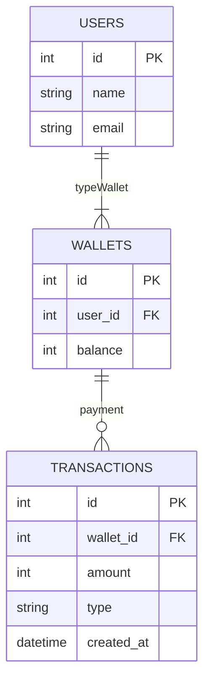

# E-Wallet

```mermaid
erDiagram

USERS {
    int id PK
    string name
    string email
}

WALLETS {
    int id PK
    int user_id FK
    int balance
}

TRANSACTIONS {
    int id PK
    int wallet_id FK
    int amount
    string type
    datetime created_at
}

USERS ||--|{ WALLETS : typeWallet
WALLETS ||--o{ TRANSACTIONS : payment


```
<!--  -->
