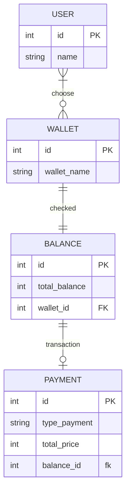

# E-Wallet

```mermaid
erDiagram

USER {
    int id PK
    string name
}

WALLET{
    int id PK
    string wallet_name
}

BALANCE{
    int id PK
    int total_balance
    int wallet_id FK
}

PAYMENT {
    int id PK
    string type_payment
    int total_price
    int balance_id fk
}

USER }|--o{WALLET : choose
WALLET||--||BALANCE : checked
BALANCE ||--o|PAYMENT : transaction

```
<!--  -->